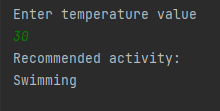
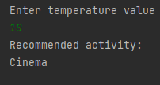

# Activity Suggestor

### This project is a project for the "java 101" class in "Patika.dev"

### It is a java program that suggests activities that can be done according to the weather data received from the user by using java conditional expressions.

+ Offer to "Ski" if the temperature is less than 5.
+ Suggest the "Cinema" event if the temperature is between 5 and 15.
+ Suggest the "Picnic" event if the temperature is between 15 and 25.
+ Suggest the "Swimming" event if the temperature is greater than 25.

# Etkinlik Önerici

### Bu proje "Patika.dev" içerisinde bulunan "Java 101" dersi için yapılan bir projedir.

### Java koşullu ifadeleri kullanılarak kullanıcıdan alınan hava durumu verisine göre yapılabilecek aktiviteleri öneren java programıdır.

### Koşullar :

 + Sıcaklık 5'dan küçük ise "Kayak" yapmayı öner.
 + Sıcaklık 5 ve 15 arasında ise "Sinema" etkinliğini öner.
 + Sıcaklık 15 ve 25 arasında ise "Piknik" etkinliğini öner.
 + Sıcaklık 25'ten büyük ise "Yüzme" etkinliğini öner.

