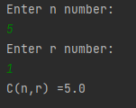

# Combination Calculation

### This project is a project for the "java 101" class in "Patika.dev"

### Program to calculate combination with Java

### Combination formula:
### C(n,r) = n! / (r! * (n-r)!)

---------------------------------------------------------------------------

# Kombinasyon Hesaplama

### Bu proje "Patika.dev" içerisinde bulunan "Java 101" dersi için yapılan bir projedir.

### Java ile kombinasyon hesaplayan program

### Kombinasyon formülü:

### C(n,r) = n! / (r! * (n-r)!)

---------------------------------------------------------------------------

------------------------------------------------------------------

