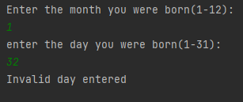
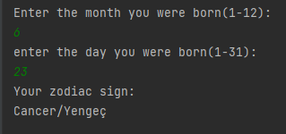
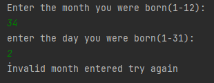

# Horoscope Calculator

### This project is a project for the "java 101" class in "Patika.dev"

### This software calculates the user's horoscope by taking the month and day information from the user.

+ Aries : March 21 - April 20

+ Taurus : April 21 - May 21

+ Gemini: May 22 - June 22

+ Cancer: June 23 - July 22

+ Leo Sign: July 23 - August 22

+ Virgo: August 23 - September 22

+ Libra Zodiac Sign: September 23 - October 22

+ Scorpio: October 23 - November 21

+ Sagittarius : November 22 - December 21

+ Capricorn: December 22 - January 21

+ Aquarius: January 22 - February 19

+ Pisces: February 20 - March 20

------------------------------------

# Burç Hesaplayıcı

### Bu proje "Patika.dev" içerisinde bulunan "Java 101" dersi için yapılan bir projedir.

### Bu yazılım kullanıcıdan ay ve gün bilgileri alarak  kullanıcının burcunu hesaplar.

+ Koç Burcu : 21 Mart - 20 Nisan

+ Boğa Burcu : 21 Nisan - 21 Mayıs

+ İkizler Burcu : 22 Mayıs - 22 Haziran

+ Yengeç Burcu : 23 Haziran - 22 Temmuz

+ Aslan Burcu : 23 Temmuz - 22 Ağustos

+ Başak Burcu : 23 Ağustos - 22 Eylül

+ Terazi Burcu : 23 Eylül - 22 Ekim

+ Akrep Burcu : 23 Ekim - 21 Kasım

+ Yay Burcu : 22 Kasım - 21 Aralık

+ Oğlak Burcu : 22 Aralık - 21 Ocak

+ Kova Burcu : 22 Ocak - 19 Şubat

+ Balık Burcu : 20 Şubat - 20 Mart

---------------

-----------------------

