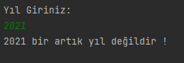
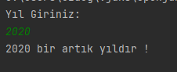

# Leap Year Calculation

### This project is a project for the "java 101" class in "Patika.dev"

### What is leap year?

#### A leap year is a year with 366 days instead of 365 in the Gregorian calendar. This extra day (leap day) is obtained by adding February 29 to February, which is normally 28 days.

-----------------------------------------------------------

# Artık YIl Hesaplama 

### Bu proje "Patika.dev" içerisinde bulunan "Java 101" dersi için yapılan bir projedir.

### Artık Yıl Nedir?

#### Artık yıl, Miladî takvimde 365 yerine 366 günü olan yıl. Bu fazladan gün (artık gün), normalde 28 gün olan şubat ayına 29 Şubat’ın eklenmesi ile elde edilir.

----------------------------------

