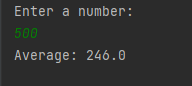
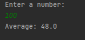

# Loops-1

### This project is a project for the "java 101" class in "Patika.dev"

### Program that calculates the average of numbers divisible by 3 and 4 from numbers 0 to the number entered with Java loops.

--------------------------------------

# Döngüler-1

### Bu proje "Patika.dev" içerisinde bulunan "Java 101" dersi için yapılan bir projedir.

### Java döngüler ile 0'dan girilen sayıya kadar olan sayılardan 3 ve 4'e tam bölünen sayıların ortalamasını hesaplayan program.

---------------------------------------

---------------------------------------

