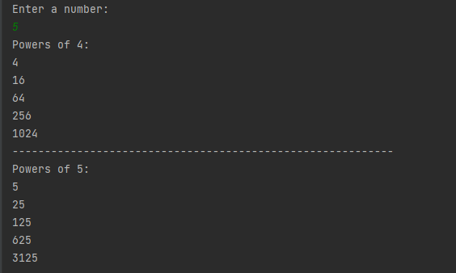

# Loops-3

### This project is a project for the "java 101" class in "Patika.dev"

### Program that prints powers of 4 and 5 up to the number entered with Java loops.

------------------------------------------------

# Döngüler-3

### Bu proje "Patika.dev" içerisinde bulunan "Java 101" dersi için yapılan bir projedir.

### Java döngüler ile girilen sayıya kadar olan 4 ve 5'in kuvvetlerini ekrana yazdıran program.

----------------------------------------------

