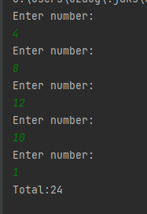
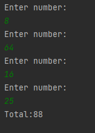

# Loops-2

### This project is a project for the "java 101" class in "Patika.dev"

### A program that accepts input from the user until a single number is entered with Java loops and adds the numbers that are even and multiples of 4 from the entered values ​​and prints them on the screen.

-------------------------------------------

# Döngüler-2

### Bu proje "Patika.dev" içerisinde bulunan "Java 101" dersi için yapılan bir projedir.

### Java döngüler ile tek bir sayı girilene kadar kullanıcıdan girişleri kabul eden ve girilen değerlerden çift ve 4'ün katları olan sayıları toplayıp ekrana basan program.

---------------------------------------------

-------------------------------------------

