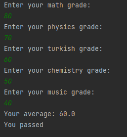

# Note Calculate 

### This project is a project for the "java 101" class in "Patika.dev"

### It is a program that calculates the status of passing the class to grade status using java conditional expressions.

### Courses:Math,Physics,Turkish,,Chemistry,Music

### Passing grade:55

# Not Hesaplayıcı

### Bu proje "Patika.dev" içerisinde bulunan "Java 101" dersi için yapılan bir projedir.

### java koşullu ifadeleri kullanılarak not durumuna sınıfı geçme durumunu hesaplayan bir programdır.

### Dersler:Matematik,Fizik,Türkçe,,Kimya,Müzik

### Geçme notu:55

-------------------------------------------------------------------

 

