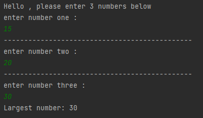
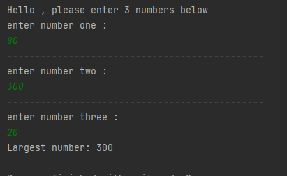
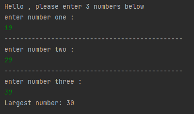

# Ranking

### This project is a project for the "java 101" class in "Patika.dev"

### A program that sorts 3 entered numbers "from smallest to largest"

# Sıralama

### Bu proje "Patika.dev" içerisinde bulunan "Java 101" dersi için yapılan bir projedir.

### Girilen 3 sayıyı "küçükten büyüğe" sıralayan bir program

----------------------------------------------

------------------------------------------------

