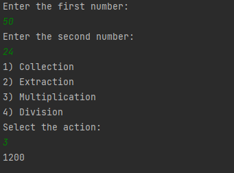

# Simple Calculate 

### This project is a project for the "java 101" class in "Patika.dev" 

### The aim of the project is to make a simple textual calculator using the "switch-case" structure.

# Basit Hesap Makinesi

### Bu proje "Patika.dev" içerisinde bulunan "Java 101" dersi için yapılan bir projedir.

### Projenin amacı "switch-case" yapısı kullanılarak basit metinsel bir hesap makinesinin yapılmasıdır

