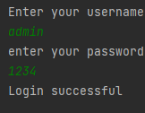

# User İnput

### This project is a project for the "java 101" class in "Patika.dev"

### If the password is wrong, it asks the user whether to reset his password, if the user wants to reset it, check that the new password must not be the same as the password he entered incorrectly and forgot, and if the passwords are the same, the screen "Could not create a password, please enter another password."java program that says "Password generated" if there is no problem.

# Kullanıcı Girişi

### Bu proje "Patika.dev" içerisinde bulunan "Java 101" dersi için yapılan bir projedir.

### Eğer şifre yanlış ise kullanıcıya şifresini sıfırlayıp sıfırlamayacağını soran, eğer kullanıcı sıfırlamak isterse yeni girdiği şifrenin hatalı girdiği ve unuttuğu şifre ile aynı olmaması gerektiğini kontrol edip , şifreler aynı ise ekrana "Şifre oluşturulamadı, lütfen başka şifre giriniz." sorun yoksa "Şifre oluşturuldu" yazan java programı.

-------------------------------------------------

