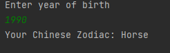

# Chinese Zodiac Calculator

### This project is a project for the "java 101" class in "Patika.dev"

### What is Chinese zodiac?

#### Chinese astrology is a type of astrology that has been used for 4000 thousand years and describes people with 12 different signs and symbols. The Chinese Zodiac is an animal ring in which these 12 signs are evenly spaced (10 degrees wide) and has little to do with the stars.

--------------------------------------------------

# Çin Zodyağı Hesaplayıcı

### Bu proje "Patika.dev" içerisinde bulunan "Java 101" dersi için yapılan bir projedir.

### Çin Zodyağı Nedir?

#### 4000 bin yıldır kullanılan bir astroloji çeşididir Çin astrolojisi ve insanları 12 değişik burç ve sembollerle tanımlar. Çin Zodyağı bu 12 burcun eşit aralıklarla(10 derece genişliğinde) sıralandığı bir hayvan halkasıdır ve yıldızlarla pek bir ilgisi yoktur.

